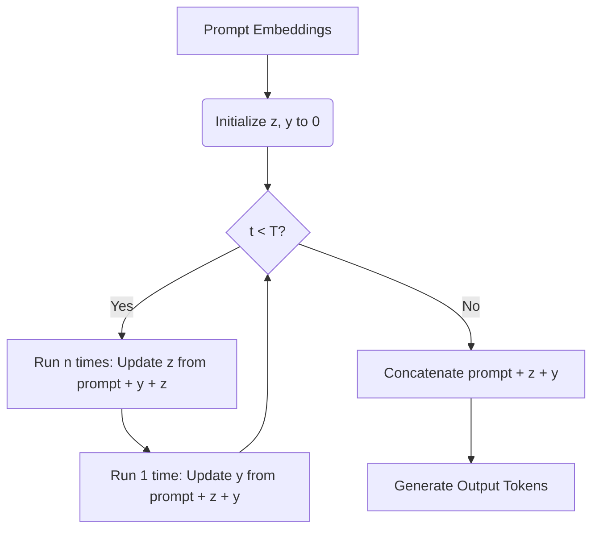

# Tiny Recursive Gemma

Recursive reasoning for code generation using small Gemma models on Apple Silicon, optimized with MLX.

## Architecture

This project implements two distinct paradigms for multi-step reasoning and refinement:

### 1. Discrete (Text-Based) Recursion
An external, explicit loop that uses the model's natural language generation to refine code.
*   **Mechanism**: The model is prompted with a task, the current code, and its previous thought. It outputs a new thought inside `<thought>` tags and updated code inside `<code_update>` tags.
*   **Implementation**: See [inference.py](src/tiny_recursive_gemma/inference.py).
*   **Pros**: 100% interpretable; you can read the "chain of thought".
*   **Cons**: Extremely high token overhead and slower inference.

### 2. Continuous (Latent-Space) Recursion
Inspired by Samsung's SAIL Montréal paper *"Less is More: Recursive Reasoning with Tiny Networks"* (arXiv:2510.04871). Instead of generating text, the model recurses directly within its hidden states. For an in-depth comparison of this repository's approach with the original paper, see the [TRM vs. Recursive Gemma Comparative Analysis](docs/trm_vs_recursive_gemma_analysis.md).
*   **Mechanism**:
    *   **Dual-Latent States**: Maintains two latent vectors: $z$ (Reasoning/Thought) and $y$ (Solution), initialized to zero.
    *   **Update Loop**: For $T$ iterations:
        1. Update reasoning state $z$ by running the transformer $n$ times on `[prompt, y, z]`.
        2. Update solution state $y$ by running the transformer $1$ time on `[prompt, z, y]`.
    *   **Generation**: Prime the final auto-regressive generation using the sequence `[prompt, z, y]`.
*   **Implementation**: See [continuous_model.py](src/tiny_recursive_gemma/continuous_model.py) and [generate_continuous](src/tiny_recursive_gemma/continuous_model.py#L23).



### Training & Memory Optimization
Training continuous recurrence is memory-intensive because unrolling $T$ steps triples the computational graph. This project solves this using:
1.  **Gradient-Free Premature Recursion**: Runs the first $T-1$ steps without tracking gradients via [loss_fn](src/tiny_recursive_gemma/training.py#L21) (applying `mx.stop_gradient`), only backpropagating through the final $T$-th step. This is mathematically exact for fixed-point/convergent reasoning states and drastically reduces memory.
2.  **Selective LoRA Layering**: Applies LoRA adapters only to the final layers (e.g., last 2 layers) of Gemma, dedicating them to the recursive reasoning mechanism while keeping base capabilities intact.
3.  **Weight EMA**: Tracks an Exponential Moving Average (EMA) of trainable weights during [train_continuous_model](src/tiny_recursive_gemma/training.py#L129) to prevent representation collapse.
*   **Implementation**: See [training.py](src/tiny_recursive_gemma/training.py).

## Comparison: Latent Recursion vs. DiffusionGemma

Google's experimental [DiffusionGemma](https://developers.googleblog.com/diffusiongemma-the-developer-guide/) (built on the Gemma 4 architecture) introduces a non-autoregressive text generation paradigm using diffusion-based parallel decoding. Below is a structural comparison of the continuous latent recursion approach implemented in this repository versus DiffusionGemma:

| Feature | `tiny-recursive-gemma` (Continuous) | DiffusionGemma |
| :--- | :--- | :--- |
| **Generation Paradigm** | Autoregressive (token-by-token) with a **latent-space pre-computation** phase. | Non-Autoregressive (block-by-block) with **parallel iterative denoising** on a token canvas. |
| **Recurrence Domain** | **Latent Space**: Recurrent reasoning updates occur *before* token emission, iteratively refining continuous state vectors ($z$ and $y$) inside the hidden layers. | **Token Space**: Recurrent updates occur *during* generation, iteratively denoising discrete tokens on a 256-token canvas. |
| **Context Flow** | Bidirectional/global during the latent update loops; strictly causal/directional during final token generation. | Bidirectional/global across the entire 256-token canvas during every denoising pass. |
| **Self-Correction** | Occurs implicitly in the latent space during $T$ updates. The final output is generated autoregressively and cannot be corrected post-generation. | Occurs explicitly on the token canvas. If token confidence drops during a pass, the sampler can re-noise and replace them. |
| **Bottleneck & Compute** | Memory-bandwidth bound during final generation (standard AR limitations). | Compute-bound. Shifting the bottleneck to compute utilizes GPU tensor cores fully, yielding up to 4x faster token generation. |
| **Use Case Fit** | Ideal for lightweight adaptation of small, pretrained models (via LoRA) on consumer hardware (Apple Silicon/MLX). | Ideal for highly constrained, non-sequential global problems (e.g., Sudoku) and high-throughput enterprise serving (vLLM). |

---

## Getting Started

### Installation & Configuration

1. Ensure you have `uv` installed, then install the project in editable mode:
   ```bash
   uv pip install -e .
   ```

2. Copy the example environment file to create your local configuration:
   ```bash
   cp .env.example .env
   ```
   By default, the `.env` file specifies the base model and adapters output directory:
   ```env
   BASE_MODEL="google/gemma-4-E2B-it-qat-q4_0-unquantized"
   ADAPTER_PATH="adapters"
   ```

### Usage

All scripts will automatically load default values from your `.env` file. You can always override these defaults at runtime by passing explicit command line arguments (e.g., `--model` or `--adapter`).


#### 1. Running Discrete (Text-Based) Inference
Run the explicit text-based refinement loop (automatically uses `BASE_MODEL` and `ADAPTER_PATH` from your `.env`):
```bash
python scripts/inference.py \
  --prompt "Write a Python function to check if a number is prime." \
  --iters 2
```

#### 2. Running Continuous (Latent-Space) Inference
Run the latent-space recursion pipeline (automatically loads the model and continuous weights based on your `.env`):
```bash
python scripts/inference_continuous.py \
  --prompt "Write a Python function to check if a number is prime."
```

#### 3. Programmatic Usage (Python API)

You can easily load and run both discrete and continuous models directly within your Python scripts:

##### Continuous (Latent-Space) Pipeline
```python
from tiny_recursive_gemma import ContinuousLatentPipeline

# Initialize the pipeline with the base model and (optional) continuous weights
pipeline = ContinuousLatentPipeline(
    model_path="google/gemma-4-E2B-it-qat-q4_0-unquantized",
    adapter_path="adapters/continuous_weights.safetensors"
)

# Run latent-space inference
response = pipeline(
    prompt="Write a Python function to check if a number is prime.",
    max_tokens=512,
    iterations=5,          # T recursion iterations
    dual_latent=True,      # Use dual (y & z) latent states
    reasoning_steps=3      # n reasoning steps per iteration
)
print(response)
```

##### Discrete (Text-Based) Recursion
```python
from tiny_recursive_gemma import run_recursive_inference

# Run the discrete text-based recursive reasoning loop
final_code = run_recursive_inference(
    model_path="google/gemma-4-E2B-it-qat-q4_0-unquantized",
    adapter_path="adapters", # Path to LoRA adapters directory
    prompt="Write a Python function to check if a number is prime.",
    max_iters=2
)
print(final_code)
```


### Training

#### Training the Continuous Model
Train the continuous model using LoRA and weight EMA (automatically uses `BASE_MODEL` and `ADAPTER_PATH` from your `.env`):
```bash
python scripts/train_continuous.py \
  --data data/train.jsonl \
  --iters 100 \
  --recursive-iters 3 \
  --lora-layers 2 \
  --ema-beta 0.99
```
Key configuration parameters in [train_continuous.py](scripts/train_continuous.py):
*   `--recursive-iters` ($T$): Number of external recursion loops.
*   `--reasoning-steps` ($n$): Inner steps to update reasoning state $z$ per loop.
*   `--no-trm`: Disables gradient-free premature recursion (tracks gradients through all steps).

### Evaluation
Measure coding performance on the HumanEval dataset using [evaluate.py](scripts/evaluate.py). All evaluations will automatically load defaults from your `.env`.

#### 1. Zero-Shot Baseline (No Recursion)
```bash
python scripts/evaluate.py \
  --baseline \
  --samples 10
```

#### 2. Discrete Recursive Evaluation
```bash
python scripts/evaluate.py \
  --iters 2 \
  --samples 10
```

#### 3. Continuous Latent-Space Evaluation
```bash
python scripts/evaluate.py \
  --continuous \
  --samples 10
```

---

## Critical Evaluation & Drawbacks

While continuous latent recursion is mathematically elegant, there are major trade-offs and reasons why you might **not** want to use it:

1.  **Zero Interpretability**: Unlike chain-of-thought prompting, you cannot inspect what the model is "thinking" during the latent recursion steps. If the model fails or outputs nonsense, debugging the state of the latent space ($z$ or $y$) is practically impossible.
2.  **Representation Capacity Bottleneck**: Forcing a pretrained 2B model to learn latent-space reasoning using a tiny 2-layer LoRA adapter is highly constrained. The adapter must learn to encode, update, and decode complex states without degrading the base model's vocabulary and generation capabilities.
3.  **Train-Inference Distribution Mismatch**: If you train the model with $T=3$ recursion steps, running inference with $T=5$ or $T=10$ steps will likely cause the latent states to drift out of distribution, leading to gibberish output. The model cannot dynamically scale its compute at runtime without custom stabilization.
4.  **Extreme Instability**: Continuous training is highly sensitive to learning rates, LoRA rank/scale, and weight decay. Without Exponential Moving Average (EMA) smoothing, the model's representations frequently collapse during training.
5.  **Hardware & Portability Lock-in**: The implementation is tightly coupled to Apple Silicon via MLX. Porting this backpropagation setup or custom embedding injection to PyTorch/CUDA requires a complete rewrite of the model's forward pass.

---

## Credits & Attribution

This project is heavily inspired by the architectural breakthroughs presented in:
*   **Paper**: *"Less is More: Recursive Reasoning with Tiny Networks"* (Samsung SAIL Montréal)
*   **ArXiv**: [arXiv:2510.04871](https://arxiv.org/abs/2510.04871)
*   **Key Contributions Adapted**: Gradient-free premature recursion (stop-gradient unrolling), dual-latent space formulation ($y$ and $z$ vectors), and selective depth adapter targeting..
