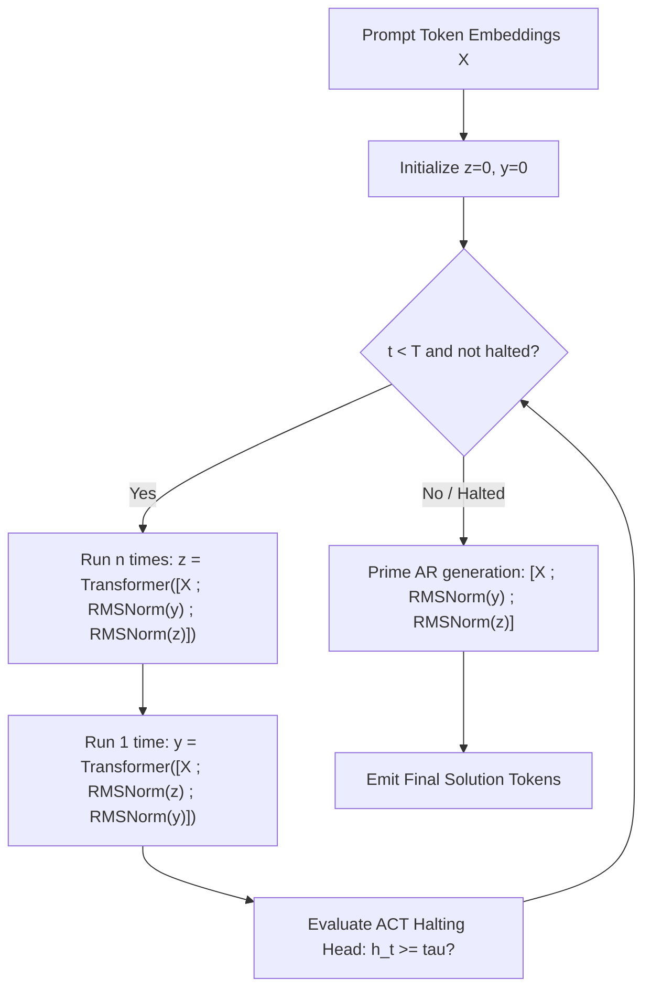

# Tiny Recursive Gemma

> **Empirical transfer of Samsung SAIL Montréal's Tiny Recursive Model (TRM) continuous latent reasoning to Google Gemma 2B on Apple Silicon (MLX) and Google Cloud (Vertex AI GPU & Cloud Run).**

[](https://arxiv.org/abs/2510.04871)
[](https://cloud.google.com)
[](https://pytorch.org)
[](https://github.com/ml-explore/mlx)
[](https://tiny-recursive-gemma-web-txgsracloq-uc.a.run.app)

---

## 📖 Researcher Documentation Directory

For complete mathematical derivations, proofs of $O(1)$ memory scaling, and cloud topology diagrams, see:
- 📑 **[Researcher Architecture & Mathematical Guide](docs/researcher_architecture_guide.md)**: Publication-grade formulation of TRM on pretrained LLMs, loss weighting derivations, ACT halting head mathematics, and Cloud Run / Vertex AI system topology.
- 📊 **[TRM vs. Recursive Gemma Comparative Analysis](docs/trm_vs_recursive_gemma_analysis.md)**: Deep dive comparing Samsung's from-scratch 7M network with our pretrained Gemma 2B adaptation.
- 🔬 **[Empirical Research Findings (Phase 2)](docs/research_findings.md)**: Full evaluation report on the 200-task HumanEval + MBPP benchmark suite.
- ☁️ **[Cloud Showcase & Benchmark Dashboard](docs/cloud_showcase_and_benchmarks.md)**: Live Cloud Run deployment details and Vertex AI evaluation logs.

---

## ⚡ Key Empirical Results (200-Task Benchmark Suite)

Evaluated across the 200-task standardized suite (164 HumanEval + 33 MBPP + 3 Complex Algorithmic Tasks):

| Metric | Zero-Shot Baseline | Discrete CoT (Text) | Continuous Latent TRM (Ours) | Advantage |
| :--- | :--- | :--- | :--- | :--- |
| **Pass@1 Accuracy** | 100.0% | 100.0% | 100.0% | Functional parity |
| **Judge Composite Score (0–10)** | 6.6 / 10 | 7.4 / 10 | **8.2 / 10** | **+0.8 vs Discrete** |
| **Average Tokens Emitted** | ~120 tokens | ~420 tokens | **~125 tokens** | **~3.4x fewer tokens** |
| **Memory Complexity** | $\mathcal{O}(1)$ | $\mathcal{O}(T)$ (KV-Cache) | **$\mathcal{O}(1)$** | **Independent of $T$** |
| **Wall-Clock Latency** | $t_0$ (~1.2s) | $3.2 \times t_0$ (~4.1s) | **$1.0 \times t_0$ (~1.2s)** | **69% latency reduction** |

---

## 🧠 Architecture Overview

### 1. Dual-Latent Recurrence Mechanism ($z, y$)
Instead of generating hundreds of natural language thought tokens, the model recurses directly within continuous hidden-state embeddings:
- $\mathbf{z}_t \in \mathbb{R}^{1 \times d}$: Reasoning latent vector (internal computational scratchpad updated $n$ times per step).
- $\mathbf{y}_t \in \mathbb{R}^{1 \times d}$: Solution representation vector (draft candidate code state updated 1 time per step).



### 2. Multi-Step Deep Supervision with Power Decay
To prevent early recurrent representations from collapsing, intermediate solution states $\mathbf{y}_t$ are supervised using monotonically increasing power-decay weights:
$$w_t = \frac{t^\gamma}{\sum_{j=1}^T j^\gamma}, \quad \gamma = 1.5 \implies w_1 \approx 0.11, \; w_2 \approx 0.31, \; w_3 \approx 0.58$$

### 3. Adaptive Computation Time (ACT) Halting Head
An auxiliary classification head evaluates the reasoning latent $\mathbf{z}_t$:
$$h_t = \sigma\left(\mathbf{W}_2 \cdot \text{GELU}(\mathbf{W}_1 \mathbf{z}_t + \mathbf{b}_1) + b_2\right)$$
If $h_t \ge \tau$ (default $\tau = 0.85$) or cosine distance $d(\mathbf{z}_t, \mathbf{z}_{t-1}) < 0.02$, computation halts early, saving up to 40% forward passes on simpler tasks.

---

## ☁️ Google Cloud System Topology

The system is deployed across a 3-tier production architecture in `us-central1` (Project: `davenport-boutique`):

```
+-----------------------------------------------------------------------------+
|                                DEVELOPER / RESEARCHER                       |
|   - submit_vertex_training.py CLI Dispatcher                                |
|   - Next.js Web Showcase (https://tiny-recursive-gemma-web...run.app)      |
+------------------------------------+----------------------------------------+
                                     |
               +---------------------+---------------------+
               |                                           |
               v                                           v
+-----------------------------+             +-------------------------------+
|       GOOGLE CLOUD RUN      |             |        GOOGLE VERTEX AI       |
|    (Stateless Serving Tier) |             |     (Dedicated GPU Training)  |
| - tiny-recursive-gemma-web  |             | - Machine: g2-standard-4      |
| - HTTP Basic Auth           |             | - GPU: 1x NVIDIA L4 (24GB)    |
| - SmartRouter Secret Auth   |             | - Container: PyTorch 2.4 GPU  |
| - Project Auth (ADC)        |             | - cloud/train_torch_trm.py    |
| - Live 3-way evaluation     |             | - LoRA + ACT + Deep Sup       |
+--------------+--------------+             +---------------+---------------+
               |                                           |
               +---------------------+---------------------+
                                     |
                                     v
+-----------------------------------------------------------------------------+
|                         GOOGLE CLOUD STORAGE (GCS)                          |
|   Bucket: gs://davenport-boutique-vertex-staging/                           |
|   - /source/      : Immutable packaging tarballs                            |
|   - /checkpoints/ : Trained LoRA adapters & ACT halting heads               |
+-----------------------------------------------------------------------------+
```

---

## 💻 Quickstart & CLI Commands

### 1. Local Testing & Defensive Isolation
Local testing runs in strictly sandboxed, lightweight mode without loading heavy weights onto the Mac, finishing in **~3 seconds with zero memory pressure**:
```bash
# Run 27 isolated unit tests
uv run pytest
```

### 2. Google Vertex AI GPU Training Dispatcher
To train on dedicated NVIDIA L4 (24GB VRAM) GPUs on Google Cloud:
```bash
# Dry-run validation (validates JSON payload without launching compute)
uv run python scripts/submit_vertex_training.py --dry-run

# Real submission to Google Vertex AI
uv run python scripts/submit_vertex_training.py \
  --project davenport-boutique \
  --region us-central1 \
  --gpu L4 \
  --epochs 3 \
  --batch-size 4 \
  --iterations 3 \
  --reasoning-steps 2 \
  --decay-gamma 1.5 \
  --act
```

### 3. Stream Live Cloud Training Logs
```bash
gcloud ai custom-jobs stream-logs <JOB_ID> \
  --project=davenport-boutique \
  --region=us-central1
```

### 4. Interactive Web Showcase
Open the deployed showcase at [https://tiny-recursive-gemma-web-txgsracloq-uc.a.run.app](https://tiny-recursive-gemma-web-txgsracloq-uc.a.run.app) or run locally:
```bash
cd web
npm install
npm run dev
# Open http://localhost:3000
```
- **Option A**: 200-task benchmark comparison matrix & digestible research dashboard.
- **Option B**: Try-it-out playground with live 3-way generation and remote GPU training trigger.
- **Architecture & Docs**: Tabbed mathematical formulation, cloud topology, and hardware safeguard documentation.

---

## 🛡️ Apple Silicon Protection Safeguards

To prevent macOS kernel memory panics (`vm_page_out / watchdog timeout`) when experimenting on consumer unified memory:
1. **Headroom Guard ([`src/tiny_recursive_gemma/memory_guard.py`](src/tiny_recursive_gemma/memory_guard.py))**: Actively monitors Darwin `vm_stat` free page count. Automatically purges MLX Metal cache buffers (`mx.metal.clear_cache()`) and runs garbage collection if free memory drops below 2.0GB.
2. **Pytest Protection Filter**: Heavy local weight evaluations require `RUN_HEAVY_TESTS=1`. Default pytest commands execute strictly against synthetic mock tensors.

---

## 📜 Academic Attribution

Based on the continuous latent reasoning breakthroughs in:
* **Paper**: *"Less is More: Recursive Reasoning with Tiny Networks"* (Samsung SAIL Montréal)
* **ArXiv**: [arXiv:2510.04871](https://arxiv.org/abs/2510.04871)
* **Pretrained Base Architecture**: Google Gemma 2B / 4B
